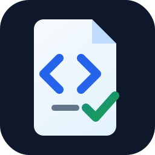

<div align="center">
	
	<h1>CodeSpec</h1>
	<h3><em>Spec-driven development for Power Apps Code Apps.</em></h3>
</div>

<p align="center">
	<strong>Create Code Apps projects with OpenSpec, GitHub Copilot workflows, and reviewable requirements from the first commit.</strong>
</p>

<p align="center">
	<a href="https://github.com/voyager163/codespec/releases/latest">
		
	</a>
	<a href="https://github.com/voyager163/codespec/stargazers">
		
	</a>
	<a href="https://github.com/voyager163/codespec/blob/main/LICENSE">
		
	</a>
	<a href="https://www.npmjs.com/package/create-codespec">
		
	</a>
</p>

---

CodeSpec is an open source initializer for teams building [Power Apps Code Apps](https://learn.microsoft.com/power-apps/developer/code-apps/overview). It combines a customized Code Apps starter, OpenSpec project artifacts, and GitHub Copilot prompt and skill files so app development can move from idea to reviewed requirements to implementation without losing decisions in chat history.

The goal is practical spec-driven development for Code Apps. CodeSpec uses OpenSpec today because it is lightweight, file-based, and easy to learn. If a better spec-driven development framework emerges, CodeSpec should be able to adopt it while preserving the same developer experience.

## Table Of Contents

- [Quick Start](#quick-start)
- [Who CodeSpec Is For](#who-codespec-is-for)
- [Why Spec-Driven Development](#why-spec-driven-development)
- [What You Get](#what-you-get)
- [Prerequisites](#prerequisites)
- [What The CLI Does](#what-the-cli-does)
- [Generated Project](#generated-project)
- [OPSX Workflow](#opsx-workflow)
- [Development Guidelines For Generated Apps](#development-guidelines-for-generated-apps)
- [CLI Options](#cli-options)
- [Contributing](#contributing)
- [Repository Layout](#repository-layout)
- [Maintaining The Starter](#maintaining-the-starter)
- [Maintaining OpenSpec Assets](#maintaining-openspec-assets)
- [Verification](#verification)
- [Publishing Checklist](#publishing-checklist)
- [License](#license)

## Quick Start

```bash
npx create-codespec my-app
cd my-app
code .
```

Initialize the Power Apps code app for your target environment:

```bash
pac code init --environment <environmentId> --displayName <appDisplayName>
```

Use the expanded OPSX workflow in GitHub Copilot to drive changes:

```text
/opsx:explore
/opsx:new
/opsx:continue
/opsx:ff
/opsx:propose
/opsx:verify
/opsx:apply
/opsx:sync
/opsx:archive
/opsx:bulk-archive
/opsx:onboard
```

Start local development:

```bash
npm run dev
```

## Who CodeSpec Is For

CodeSpec is for developers and teams who want to build Power Apps Code Apps with a repeatable, reviewable workflow:

- makers and developers starting a new Code Apps project;
- teams using GitHub Copilot for implementation but wanting durable requirements;
- maintainers who want app behavior captured in repository files rather than scattered chat transcripts;
- organizations evaluating spec-driven development for Power Platform work.

## Why Spec-Driven Development

AI-assisted development works best when the project keeps its intent close to the code. CodeSpec encourages a loop where ideas become files that can be reviewed, changed, implemented, verified, and archived.

```text
Explore the idea -> propose the change -> generate specs/design/tasks -> implement -> archive
```

OpenSpec keeps that loop lightweight:

- Fluid, not rigid.
- Iterative, not waterfall.
- Easy to start, but organized enough for real projects.
- Built around project files that can be reviewed, updated, and archived.

OpenSpec is the current framework choice, not an irreversible constraint. CodeSpec is about making spec-driven development practical for Code Apps; the framework can evolve if the ecosystem gives the project a better fit.

## What You Get

A generated CodeSpec app includes:

- a Vite, React 18, and TypeScript Code Apps starter;
- Tailwind CSS, shadcn/ui components, theming, and Lucide icons;
- React Router, TanStack Query, TanStack Table, and Zustand;
- an OpenSpec configuration tailored for Power Apps Code Apps;
- all OPSX prompt files for GitHub Copilot under `.github/prompts/`;
- matching OpenSpec skill folders under `.github/skills/`;
- project-local guidance for exploration, proposal, implementation, verification, syncing, and archiving.

## Prerequisites

- Node.js 20.19.0 or newer
- npm
- git
- Power Platform CLI for `pac code init`
- Visual Studio Code with GitHub Copilot
- OpenSpec

If OpenSpec is missing, the initializer installs it automatically:

```bash
npm install -g @fission-ai/openspec@latest
```

## What The CLI Does

The initializer runs this setup flow:

```text
1. Ask for a project name if missing
2. Check Node.js
3. Check npm
4. Check git
5. Check OpenSpec and install it if missing
6. Fail if the target folder already exists
7. Copy templates/starter into the target folder
8. Copy the OPSX prompts and skills into .github/
9. Run npm install
10. Run openspec init or openspec update
11. Replace openspec/config.yaml with the fixed Code Apps config
12. Run git init
13. Print next steps
```

The initializer does not install Code Apps assistant plugins, register plugin marketplaces, or ask developers to choose an AI assistant.

## Generated Project

Generated projects include:

```text
my-app/
	package.json
	src/
	public/
	openspec/
		config.yaml
		changes/
		specs/
	.github/
		prompts/
			opsx-*.prompt.md
		skills/
			openspec-*/
```

The generated `openspec/config.yaml` is tailored for Power Apps Code Apps:

```text
Platform: Power Apps Code Apps
Frontend: Vite + React 18 TypeScript
Styling: Tailwind CSS
Routing: React Router
Data: TanStack Query + Power Platform connectors
Auth: Power Platform managed
Deploy: pac CLI
```

## OPSX Workflow

Use the expanded OpenSpec workflow commands as the normal development path. Generated projects include all 11 OPSX prompt files and all 11 matching OpenSpec skill folders by default.

| Command | Purpose |
| --- | --- |
| `/opsx:explore <idea>` | Think through an idea without implementing. Use this for architecture exploration, problem framing, risks, and tradeoffs. |
| `/opsx:new <change>` | Start a new change and inspect the first artifact instructions before drafting. |
| `/opsx:continue <change>` | Continue creating or updating artifacts for an active change. |
| `/opsx:ff <change>` | Fast-forward artifact creation until the change is ready for implementation. |
| `/opsx:propose <change>` | Create a proposal, design, specs, and tasks for a new change. |
| `/opsx:verify <change>` | Check that the change artifacts are complete and internally consistent. |
| `/opsx:apply <change>` | Implement the tasks from an approved OpenSpec change. |
| `/opsx:sync <change>` | Sync completed change artifacts back into the canonical specs when appropriate. |
| `/opsx:archive <change>` | Archive a completed change and sync the final specs. |
| `/opsx:bulk-archive` | Archive multiple completed changes when the workspace has accumulated finished work. |
| `/opsx:onboard` | Inspect the project and generate onboarding context for the assistant. |

## Development Guidelines For Generated Apps

Follow these rules when building Code Apps from the generated project.

- Start meaningful work with `/opsx:explore`, `/opsx:new`, `/opsx:ff`, or `/opsx:propose` before implementation.
- Keep requirements in OpenSpec artifacts, not only in chat history.
- Use Power Platform connectors for runtime data access.
- Do not add a custom backend unless the OpenSpec change explicitly justifies it.
- Do not add a custom auth layer; authentication is handled by Power Platform.
- Use generated services under `src/generated/` when Power Apps tooling creates connector services.
- Keep TypeScript strict and fix type errors before considering a task complete.
- Keep UI changes consistent with the starter's Vite, React, Tailwind, and routing conventions.
- Run build and verification commands before archiving a change.

## CLI Options

```bash
npx create-codespec my-app --skip-install
npx create-codespec my-app --skip-git
```

By default, `npm install` and `git init` both run automatically.

The CLI fails if the target folder already exists. This avoids accidental overwrites.

## Contributing

CodeSpec is open source. Contributions are welcome around the starter template, OPSX workflow, OpenSpec configuration, verification coverage, docs, and future spec-driven development framework evaluation.

Please read [CONTRIBUTING.md](CONTRIBUTING.md) before opening a pull request. By participating in this project, you also agree to follow the [Code of Conduct](CODE_OF_CONDUCT.md).

## Repository Layout

This repository contains both the initializer and the templates it copies.

```text
codespec/
	bin/
		create-codespec.js
	templates/
		starter/
			SOURCE.md
			package.json
			src/
			public/
		openspec/
			config.yaml
		github/
			prompts/
			skills/
	openspec/
		changes/
		specs/
	scripts/
		verify-generated-project.js
```

`templates/starter` was imported once from `microsoft/PowerAppsCodeApps/templates/starter`. This repo now owns that snapshot, so future starter changes should be made here intentionally.

## Maintaining The Starter

When updating the starter template:

1. Edit files under `templates/starter/`.
2. Keep [templates/starter/SOURCE.md](templates/starter/SOURCE.md) accurate if you intentionally resync from upstream.
3. Make sure generated projects still build with `npm run build`.
4. Run the verification script in this repo.

Do not make the CLI fetch the Microsoft starter during project creation. The initializer should always use the local customized starter.

## Maintaining OpenSpec Assets

The generated `.github` files come from [templates/github](templates/github).

If the repo's live OPSX prompts or skills are updated, sync the template copy as well:

```bash
rm -rf templates/github/prompts templates/github/skills
mkdir -p templates/github/prompts templates/github/skills
cp -R .github/prompts/. templates/github/prompts/
cp -R .github/skills/. templates/github/skills/
```

Generated projects should include all 11 OPSX prompt files and all 11 OpenSpec skill folders.

## Updating OpenSpec

To update OpenSpec globally:

```bash
npm install -g @fission-ai/openspec@latest
```

Inside an existing generated project, refresh OpenSpec instructions with:

```bash
openspec update
```

This initializer overwrites `openspec/config.yaml` during creation so generated projects receive the Power Apps Code Apps defaults.

## Verification

Run the smoke verification script:

```bash
npm run verify
```

The script creates a temporary generated project and checks that:

- the starter files are copied;
- OpenSpec initializes successfully;
- all 11 OPSX prompt files are present;
- all 11 OpenSpec skill folders are present;
- `openspec/config.yaml` matches the fixed Power Apps Code Apps config.

Before publishing or handing off a change, also run:

```bash
node --check bin/create-codespec.js
node --check scripts/verify-generated-project.js
npm pack --dry-run
```

For documentation or community-file changes, also review:

- README badge links and image paths;
- accessible alt text for media assets;
- links to [CONTRIBUTING.md](CONTRIBUTING.md), [CODE_OF_CONDUCT.md](CODE_OF_CONDUCT.md), and [LICENSE](LICENSE);
- CodeSpec project identity terms;
- Power Apps Code Apps, `pac code init`, and `microsoft/PowerAppsCodeApps` references.

## Publishing Checklist

Before publishing a package version:

1. Run `npm run verify`.
2. Run `npm pack --dry-run` and inspect the included files.
3. Confirm `templates/starter` contains no local secrets or generated build output.
4. Confirm [templates/openspec/config.yaml](templates/openspec/config.yaml) has the desired Power Apps Code Apps defaults.
5. Confirm [templates/github](templates/github) contains exactly the expected OPSX prompts and skills.
6. Confirm README badges, community links, and media assets render correctly.

## License

MIT. The starter template snapshot is based on Microsoft's Power Apps Code Apps starter, which is also MIT licensed.