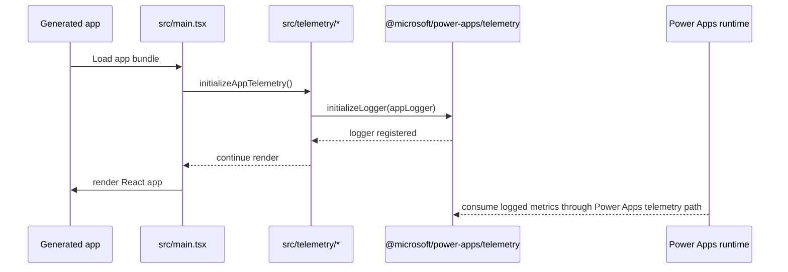

## Context

CodeSpec generates Power Apps Code Apps projects from the local `templates/starter` snapshot and then overlays OpenSpec configuration and OPSX assistant assets. The starter already uses React 19 dependencies, but generated-project guidance still names React 18. The fixed OpenSpec context also describes Vitest, Playwright, Prettier, and Application Insights telemetry practices that are not currently present in the starter template.

This change should make the generated starter match its guidance while preserving the current platform constraints: Power Apps Code Apps runtime, Vite, TypeScript, Tailwind CSS, React Router, TanStack Query, Power Platform-managed authentication, and no custom backend.

## Goals / Non-Goals

**Goals:**

- Align repository docs and generated OpenSpec context with React 19.
- Add unit and e2e test tooling that works immediately in a generated project.
- Add Prettier formatting as a companion to ESLint and strict TypeScript.
- Add a minimal telemetry integration point using `@microsoft/power-apps/telemetry`.
- Expand generated-project verification to catch missing starter scaffolding.

**Non-Goals:**

- Do not downgrade the starter to React 18.
- Do not add a custom backend, custom authentication layer, or non-Power Platform data access pattern.
- Do not invent a full Application Insights SDK wrapper beyond the public `@microsoft/power-apps/telemetry` contract.
- Do not change the OpenSpec workflow or OPSX prompt/skill set.

## Decisions

### Keep React 19 and update guidance

The starter already declares React 19 and matching React type packages. The lowest-risk path is to update CodeSpec guidance from React 18 to React 19 instead of changing dependencies back to React 18.

Alternative considered: downgrade to React 18 to match the existing config text. This would move away from the imported starter snapshot and create dependency churn without solving a runtime issue.

### Use Vitest with React Testing Library for unit smoke coverage

Generated projects should include a `test` script, a non-watch `test:run` script, a test setup file, and at least one component smoke test. React Testing Library plus jsdom gives the starter a realistic way to test React behavior rather than only pure utility functions.

Alternative considered: install Vitest only. That would satisfy a dependency checkbox but leave generated apps without a clear component testing pattern.

### Use Playwright with automatic dev-server startup

Generated projects should include a Playwright config that starts `npm run dev` and an e2e smoke test that loads the home page and exercises a simple interaction. This validates the actual browser app, including Vite, routing basename behavior, Tailwind rendering, and starter UI wiring.

Alternative considered: provide Playwright dependencies without a test. That would still leave adopters to discover the correct server and base URL setup themselves.

### Keep ESLint and Prettier separate

Prettier should be configured with `format` and `format:check` scripts, while ESLint remains responsible for code-quality checks. This avoids formatter rules turning ordinary lint runs into formatting failures and keeps the generated starter approachable.

Alternative considered: integrate Prettier into ESLint. That creates one command for style and linting, but tends to add noise and extra plugin dependencies to starter projects.

### Add a thin Power Apps telemetry scaffold

The published `@microsoft/power-apps` package exposes `@microsoft/power-apps/telemetry`, including `ILogger`, `initializeLogger`, and metric types. The starter should initialize an `ILogger` through `initializeLogger` and provide a small local logger module that app code can extend.

The scaffold should not require an Application Insights connection string or direct `trackEvent` API because those are not exposed by the inspected package types. Metrics should flow through the Power Apps telemetry contract.

Alternative considered: wire `@microsoft/applicationinsights-web` directly. That would make Application Insights explicit, but it may conflict with Power Apps runtime ownership and would require configuration the current starter does not have.

## Risks / Trade-offs

- Playwright browser installation can add setup time for contributors and generated-project users -> document the scripts and keep e2e coverage to a minimal smoke test.
- React Testing Library adds dependencies beyond Vitest -> accept the small cost because it gives generated apps a useful component-test pattern.
- Telemetry semantics may be runtime-specific -> keep the starter scaffold thin and tied to `ILogger`/`initializeLogger` only.
- Generated-project verification may become slower if it installs dependencies or runs browser tests -> separate file-shape smoke checks from full starter validation where appropriate.

## Migration Plan

1. Update starter package scripts, dependencies, and config files for Vitest, Playwright, and Prettier.
2. Add starter smoke tests and telemetry scaffolding under `templates/starter`.
3. Update `templates/openspec/config.yaml` and README references from React 18 to React 19.
4. Update verification to assert the generated starter includes the new scripts/config/files.
5. Run repository verification and starter-level build/test/format checks.

Rollback is file-based: revert the starter template changes, docs/config wording, and verification additions. Existing generated projects are unaffected because CodeSpec does not mutate projects after creation.

## Open Questions

- Should generated-project verification run starter tests, or only assert that the starter contains the expected tooling files and scripts?
- Should Playwright browsers be installed during CodeSpec repository validation, or left to generated-project users via Playwright's standard install flow?
